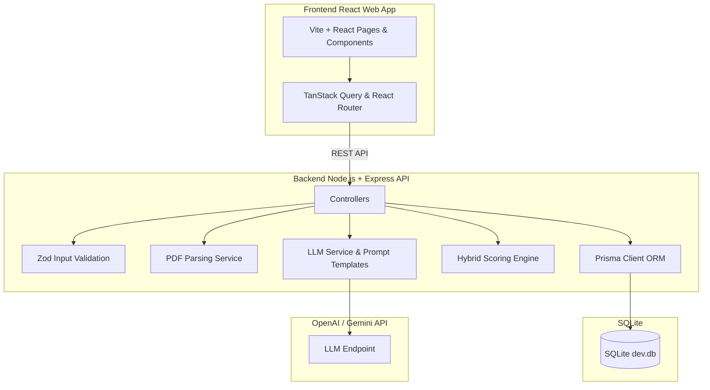

# Smart Resume Screener

A professional, human-centered web application designed to help recruiters and hiring managers intelligently screen, rank, and analyze candidate resumes against job descriptions. 

This project is built to showcase clean full-stack architecture, relational database integrity, deterministic-semantic hybrid matching, explainable AI insights, and strict candidate privacy.

---

## Live Deployments

The application is deployed and fully operational:

*   **🔒 Recruiter Portal (Vercel)**: [https://smart-resume-screener-mi55iigon.vercel.app](https://smart-resume-screener-mi55iigon.vercel.app)
    *   *Demo Credentials*: Username: `admin` / Password: `admin123`
*   **💼 Candidate Application Link (Vercel)**: [https://smart-resume-screener-mi55iigon.vercel.app/apply/3b90dd2c-c5e4-4066-ae59-079b70234c99](https://smart-resume-screener-mi55iigon.vercel.app/apply/3b90dd2c-c5e4-4066-ae59-079b70234c99) *(direct link to apply for the seeded Senior Full-Stack role)*
*   **⚡ Backend API Server (Render)**: [https://smart-resume-screener-api.onrender.com](https://smart-resume-screener-api.onrender.com)

---

## The Problem
Recruiters are often flooded with hundreds of resumes for a single job opening. Traditional Applicant Tracking Systems (ATS) rely on dumb keyword matching, which misses qualified candidates who describe their skills differently. Conversely, naive "AI-only" screenings act as a mysterious black box—spitting out arbitrary percentages with no breakdown of *why* the candidate matched, leading to a lack of transparency, trust, and auditing capability.

## The Solution
**Smart Resume Screener** acts as an intelligent assistant. It extracts candidate profiles (skills, experience, and academic history) relationally, calculates a deterministic score breakdown based on explicit requirements, and then uses a Large Language Model (LLM) to perform semantic adjustments and generate a transparent justification (strengths, gaps, and potential concerns).

This approach ensures that screening is:
1.  **Explainable**: The recruiter sees the exact score breakdown for Skills, Experience, Education, and Alignment.
2.  **Deterministic-First**: Baseline scoring rules are written in code, not left to LLM hallucination.
3.  **Privacy-Preserving**: Candidates upload their resumes via a secure, isolated application link. They never see other applicants' data, resumes, or matching scores. Only the authenticated recruiter has access to the central dashboard.

---

## Key Features
*   **Secure Split Portals**: 
    *   **Recruiter Portal**: Protected by credentials. Includes a dashboard, job creation form, and full candidate screening reports.
    *   **Candidate Portal**: A clean, public-facing page (`/apply/:jobId`) allowing applicants to read the job description and upload their resume. Candidates receive a friendly confirmation message without exposing private data or matching scores.
*   **Relational Database Parsing**: Resumes are parsed and stored relationally (separating Skills, Experience, and Education tables) instead of dumping unstructured JSON blobs.
*   **Hybrid Matching Engine**: 0-100 score calculated via a weighted multi-factor formula (Skills 45%, Experience 30%, Education 10%, Domain Alignment 15%).
*   **Multi-File Uploads**: Screen multiple resumes in parallel via a drag-and-drop PDF upload interface.
*   **Interactive Timelines**: Render candidate history, education milestones, and parsed skills in an elegant, clean SaaS dashboard interface.
*   **Error Resilient**: Robust parsing fallbacks, file size limits (5MB), and validation of LLM outputs via strict Zod schemas.

---

## Architecture Diagram



---

## Tech Stack

### Frontend
*   **React 18** (Vite-powered, TypeScript)
*   **Tailwind CSS** (clean typography, modern design tokens)
*   **TanStack Query (React Query v5)** (state management, automatic caching, refetching)
*   **React Hook Form & Zod** (validated, lightweight form inputs)
*   **React Router Dom v6** (declarative client-side routing)

### Backend
*   **Node.js & Express** (RESTful architecture)
*   **TypeScript** (unified type-safety across stack)
*   **Prisma ORM** (relational migrations and type-safe database queries)
*   **Zod** (strict request validation and LLM response sanitization)
*   **pdf-parse** (pure-JS PDF text extraction)
*   **OpenAI Node Client** (supports both standard OpenAI and Google Gemini APIs natively)

---

## Database Schema

```text
    ┌─────────────┐
    │     Job     │
    └──────┬──────┘
           │ 1
           │
           │ *
  ┌─────────┴─────────┐       1 ┌───────────────┐
  │  ScreeningResult  ├─────────┤   Candidate   │
  └───────────────────┘         └───────┬───────┘
                                        │ 1
                    ┌───────────┬───────┴───────────┬───────────┐
                    │ *         │ *                 │ 1         │ *
              ┌─────┴─────┐┌────┴─────┐       ┌─────┴─────┐┌────┴─────────┐
              │ Education ││Experience│       │Skill Link ││CandidateSkill│
              └───────────┘└──────────┘       └─────┬─────┘└──────────────┘
                                                    │ *
                                              ┌─────┴─────┐
                                              │   Skill   │
                                              └───────────┘
```

*   **Job**: Stores job details and structured specification requirements parsed using the LLM (e.g., required skills, preferred skills, min experience).
*   **Candidate**: Base profile containing name, email, phone, and resume text content.
*   **Experience / Education**: Timelines detailing company roles, institution degrees, fields of study, and years.
*   **Skill / CandidateSkill**: Unique skills index and intermediate junction table indicating candidate proficiency.
*   **ScreeningResult**: Links Candidate to a Job with scores, recommendations, strengths, concerns, and matching reasons.

---

## Matching & Scoring Approach

The final score (0–100) is calculated through a hybrid engine combining deterministic calculations and semantic LLM refinement:

1.  **Technical Skills Match (45%)**
    *   **Base Score (45 pts)**: Calculated deterministically. `(matched_required / total_required) * 35` + `(matched_preferred / total_preferred) * 10`.
    *   **LLM Semantic Adjustment (+/- 5 pts)**: The LLM refines the score based on candidate proficiency levels and context of usage (e.g., superficial mention vs production implementation).
2.  **Experience Relevance (30%)**
    *   **Base Score (30 pts)**: Calculated deterministically. Sums parsed experience blocks and measures years against required: `(candidate_years / required_years) * 30` (capped at 30).
    *   **LLM Semantic Adjustment (+/- 5 pts)**: The LLM adjusts based on career trajectory (e.g., senior-level responsibilities vs junior tasks).
3.  **Education Credentials (10%)**
    *   **Base Score (10 pts)**: Evaluates candidate highest degree against job requirement using standard hierarchy (PhD > Master's > Bachelor's > Associate).
    *   **LLM Semantic Adjustment (+/- 2 pts)**: The LLM adjusts for field of study relevance (e.g., CS degree vs General Science degree).
4.  **Domain & Role Alignment (15%)**
    *   **LLM Score (15 pts)**: Complete semantic evaluation of the similarity between candidate's past job details and the job duties.

### Recommendation Bands
*   **Score >= 85**: `Strong Match` (Well aligned tech stack, meets experience/degree milestones)
*   **70 <= Score < 85**: `Good Match` (Solid technical capabilities, minor gap in cloud/tools or years)
*   **50 <= Score < 70**: `Partial Match` (Possesses core skills but major gaps in architecture/seniority)
*   **Score < 50**: `Weak Match` (High mismatch in programming stack or core engineering focus)

---

## LLM Prompts

Prompts are stored inside `server/src/services/prompts.ts` as structured functions. They leverage strict system roles:

### 1. Resume Extraction
```text
You are an expert AI resume parsing system. Parse the raw resume text into structured candidate information.
Return a valid JSON object matching the schema: candidate (name, email, phone), summary, skills (array), experience (company, role, startDate, endDate, description, relevantSkills), education (institution, degree, field, startYear, endYear).
Strict Rules: Do not invent or assume information. If a field is not present in the text, use null or empty array. Return only raw JSON.
```

### 2. Job Description Parsing
```text
You are an expert recruitment analyst. Parse the raw job description and extract title, requiredSkills (array), preferredSkills (array), minimumExperience (number), educationRequirements (array), responsibilities, and keywords.
Strict Rules: Extract only what is explicitly specified. Return only raw JSON.
```

### 3. Match Evaluation & Adjustments
```text
You are an expert senior recruiter. Compare candidate profile against job description. We computed preliminary deterministic baseline scores: Skills: X/45, Experience: Y/30, Education: Z/10. Provide semantic adjustments: skillsAdjustment (-5 to +5), experienceAdjustment (-5 to +5), educationAdjustment (-2 to +2), domainAlignmentScore (0 to 15), alongside strengths, missingSkills, relevantExperience, concerns, and a justification summary.
Strict Rules: Keep adjustments objective and explainable. Return only raw JSON.
```

---

## Setup & Running Guide

### Prerequisites
*   **Node.js** (v18 or higher)
*   **API Key**: Either an OpenAI API Key or a Google Gemini API Key.

### 1. Clone & Install
```bash
# Clone the repository
git clone <repo-url>
cd Smart-Resume-Screener

# Install all packages (root, server, client)
npm run install:all
```

### 2. Environment Configuration
Create a `.env` file in the `server/` directory:
```bash
DATABASE_URL="file:./dev.db"
OPENAI_API_KEY="your-api-key"
```

#### Using Google Gemini (Free Tier)
This project includes **native Google Gemini API integration**. If you use a Google Gemini key (which begins with `AQ.` or `AIzaSy`), set up your `server/.env` as:
```env
DATABASE_URL="file:./dev.db"
OPENAI_API_KEY="your-gemini-api-key"
OPENAI_MODEL="gemini-3.6-flash"
```
*(No base URL configuration is required; the backend automatically routes keys starting with `AQ.` or `AIzaSy` to the Google Gemini native REST endpoints).*

### 3. Setup and Seed Database
Generate the database schema and pre-populate the database with the seed candidates and job description:
```bash
# Generate Prisma Client and migrate local SQLite database
npm run build --prefix server
```

### 4. Launch the Application
Start both the backend API and the React frontend in development mode:
```bash
npm run dev
```
*   Recruiter Dashboard: [http://localhost:3000](http://localhost:3000) (Credentials: `admin` / `admin123`)
*   Candidate Apply Link: [http://localhost:3000/apply/:jobId](http://localhost:3000/apply/:jobId)

---

## Running Tests

Run the test suite (verifying scoring algorithms and API routes via Vitest + Supertest):
```bash
npm run test
```

---

## Design Decisions & Trade-offs
*   **SQLite Database**: Opted for SQLite by default to make the local environment entirely zero-dependency. This ensures the project runs out of the box without requiring PostgreSQL or Docker installations.
*   **Memory Storage for PDF Uploads**: Rather than saving uploaded PDFs to disk, we process files inside memory buffers. This avoids writing trash files to local filesystems, simplifies security audits, and ensures scalability.
*   **Vite Proxy Configuration**: The client Vite server is configured to proxy `/api` paths to `http://localhost:5000` to prevent CORS issues during local development without polluting the React application with hardcoded backend endpoints.

---

## Limitations
*   **PDF Text Variety**: The accuracy of text extraction depends on whether the PDF contains text metadata. Scanned image PDFs will require OCR preprocessing, which is omitted in this prototype to keep dependencies lightweight.
*   **Token Constraints**: Resumes exceeding ~10,000 words will be truncated to fit model context boundaries.
*   **Advisory Matching**: The final score is designed as a screening aid and should not replace human hiring judgments.
